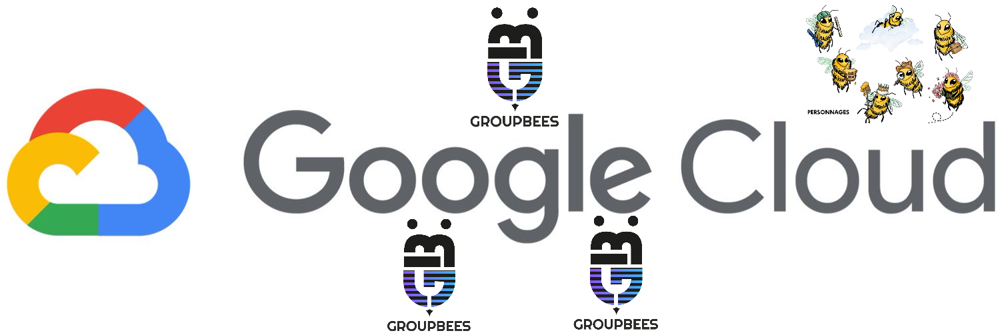

# About me 👋

Passionate about tech and Data, Craftsman at heart and functional programming lover, I work on long missions or specialized expertise with many customers.

Tech Lead Full-Stack in the past, I set up architectures (Hexagonal, Domain Driven Design) and helped teams to improve their code quality and propose best practices.

Today Lead and Architect Data on Google Cloud, I evangelize this platform while ensuring continuous improvement and expertise.
I explore issues related to Data, Infra As Code, DevOps automation (CI/CD) and best practices.

I am also very active in the Google Cloud community:
- I help the GCP community on Stackoverflow: https://stackoverflow.com/users/9261558/mazlum-tosun
- I write Google Cloud articles on Medium: https://medium.com/@mazlum.tosun
- I created Open Source libraries on Apache Beam and Dataflow to help the Beam and Google Cloud communities:
  - Asgarde Java-Kotlin/Simplify error handling with Apache Beam : https://github.com/tosun-si/asgarde
  - Asgarde Python/Simplify error handling with Apache Beam : https://github.com/tosun-si/pasgarde
  - Midgard Python/More concise and expressive code for Beam with Kotlin : https://github.com/tosun-si/midgard

- Goal of creating other libraries and side projects in the GCP community

Co-founder and Head of Data & Cloud of GroupBees, a group of freelances consultants intended to give them access to a framework, to a community based on sharing in order to ensure them a rise in skills as well as better employability:

- Promote the GroupBees label by helping to build a great community of freelancers: good mindset and very good technical skills of our members
- Animation of the GroupBees Tech community with side projects and organization of monthly BShare sharing talks: https://www.youtube.com/channel/UCARW8PvH1T0yAkTiPbGLeiA
- Expertise interventions with customers for implementation on Data and Google Cloud topics

### 🔗 Let's Connect!

